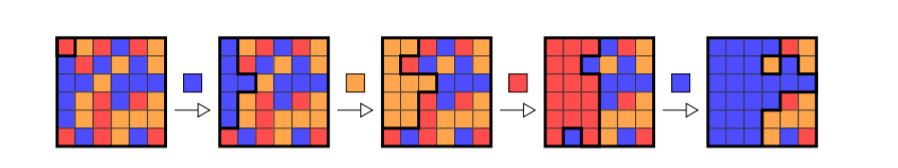
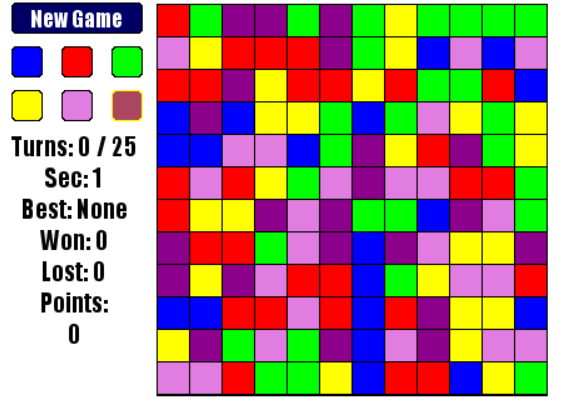

# 摘要
这篇文章中我们会介绍游戏Flood-It，并比较它的数种解法。

# Flood-It
Flood It是这样一个游戏，它要求玩家每次选择一种颜色（称为一种“操作”），使得一个色彩斑斓的棋盘最后变成一种颜色，使用的操作数越少就越好。


<center>图一.  一个典型的Flood-It游戏过程，从初始状态开始，一共进行了蓝、橙、红、蓝四个操作。</center>
<br>

如果你还是不清楚这个游戏是怎么回事，最好的办法可能就是去玩一玩它。
在线：https://unixpapa.com/floodit/
github项目：https://github.com/metulburr/FloodIt

<br>
本文的实验环境中，游戏采用12x12的棋盘，共六种颜色，用0~5表示。游戏如下图所示。



后面几个段落简要介绍了一些解法和他们的成绩，在每个段的段尾，我们会给出一个算法成绩，这是通过使用这个算法测试100次平均得出的。

# 随机算法
每次在六种颜色中随机的选择一种。
```python
while not done:
    done = game.step(
        rand_action(min=0, max=5)
    )
```
很难说这是一种好的算法，但是它确可以作为一种我们衡量这个设定下游戏难度的baseline。

成绩：33.2

# 基于左上角面积的贪婪算法
将六种颜色都试验一遍，取能够使左上角面积最大的那一个颜色。这样子找出来的结果显然不一定是最优解。
```python
while not done:
    largest_area = -1
    best_action = -1
    for i in range(6):
        tmp_game = deepcopy(game)
        tmp_game.step(i)
        if tmp_game.area > largest_area:
            largest_area = tmp_game.area
            best_action = i
    done = game.step(best_action)
```
上面这个算法只探索了一步，我们还可以做一个n步的贪婪算法：
```python
actions = itertools.product((0, 1, 2, 3, 4, 5), repeat=n)
# ...test and find the best action
for a in best_action:
    game.step(a)
```
这会使运算的时间变长，效果也相应变好。
成绩：
|深度|成绩|
| ------ | ------ |
|1|22.95|
|2|21.53|
|3|21.00|
|4|20.43|

# A*算法
为了说明A*算法下面我们形式化的描述一下游戏过程。
设起始状态为s，进行一个颜色操作i之后达到状态$s_i$，我们可以想象某一个状态$s_{4125012301403450}$可能会是一个终止状态，其棋盘上只有一个颜色。我们将类似$4125012301403450$的一串操作成为一个“路径”（path），则游戏过程为：
$
s  \rightarrow s_{path_{1}} \rightarrow s_{path_{2}}  \rightarrow s_{path_{3}} \rightarrow ... \rightarrow s_{path_{n}}(终态)
$
游戏目的是求min(n)

A\*是这样一个算法：首先我们维护一个状态池S，初始时$S = \{s\}$，即只有初态。
对于池中的某一个状态$s_i$，都会有候选状态$s_{i0}, s_{i1}, s_{i2}, ..., s_{i5}$（也就是再进行一个操作可以到达的那些状态），把$S$中所有状态的所有候选状态放进一个集合，这样我们可以构造一个候选状态池$S_{open}$。
接下来，我们从$S_{open}$中选择一个状态（先不管怎么选的），检查它是否为一个终止态，如果不是，将其放入$S$中，并刷新$S_{open}$。可以想象，这样$S$和$S_{open}$都会越来越大，直到我们找到一个终止态，游戏就结束了。
A\*要解决的一个问题是，怎么从$S_{open}$中选择一个状态来探索，这样一个个选到最后第一个找出来那个终止态又是不是最优的。
先回答第一个问题：
先探索$f(s_j) = g(s_j) + h(s_j)$最小的那个状态。其中$g(s_j)$指的是从$s$走到$s_j$花的步数，比如说$g(s_{3223}) = 4$；$h(s_j)$是一个*预估*$s_j$到终止态需要的步数，这是一个经验函数，是我们根据经验“猜测”，大概还要花多少步才能走到终点。
可以这样理解，$g(s_j)$是一个控制“成本”的一个项，它告诉程序，你到这里已经走了很多步了，如果我很大，再探索这里或许得不偿失；$h(s_j)$是一个“收益”项，它告诉模型，可能你很快就能走到终点了，如果我很小，你应该选这一项。两相平衡，就可以得到一个比较好的搜索算法。
再回答第二个问题：
何时找到的解是最优的呢？这里要提到一个admissible条件：即，假设对于一个状态$s_j$，走到终态的最短步数是$h^*(s_j)$，而我们猜测的$h(s_j)$总满足$h(s_j) \leq h^*(s_j)$，那么找出来的解一定是最优的。这里不予证明。
选择不同的$h(s_j)$，结果可能天差地别，我的算法是
```python
        f = step + max(smallest_manhattan_distance, len(remain_color) - 1) + \
            (144 - target_area) * 1.0 / 144
```
主要是考虑了左上角盘面到右下角的最短曼哈顿距离，以及剩下的颜色数目。
结果是非常漂亮的，但是这个函数在设计的时候是为了使结果尽量的好（而不是快），所以一个实验所需的时间是按小时计算的，而且需要100G左右的内存支持。
成绩：18.5

# 基于深度Q学习的贪婪算法
深度强化学习在决策论中异军突起，我们怎么能不试试它呢！
事实上我个人认为，Q学习的本质是指出贪婪算法的目标不合理。我们都知道，子问题最优不代表全局最优，所以贪婪算法找出的解不一定是最优的。
Q学习的解决方案是，基于统计学算出一个对状态$s_i$的估计，这一估计是考虑了全局的，所以理论上说，基于大数定理，只要模拟游戏次数够多，这个估计就一定会准，而且比我们拍脑袋想出来的经验函数会准得多。
有关深度Q学习的详细算法可以另开一篇博文，读者也可以参考[莫烦的教程](https://morvanzhou.github.io/tutorials/machine-learning/reinforcement-learning/2-2-A-q-learning/)。
从结果上来说，可以理解为我们用一个深度神经网络（这里是一个21层的ResNet）学到了一个“估计器”，它能够估计一个状态的好坏，而且这个估计器的结果要比上面基于左上角面积的贪婪算法估计得更准确。
因此可以：
```python
actions = itertools.product((0, 1, 2, 3, 4, 5), repeat=n)
# ...test with Q learning and find the best action
for a in best_action:
    game.step(a)
```
我们同样是生成n步长的path，然后依次测试哪个最优，唯一的不同是，这里“优”的标准从左上角的面积变成了神经网络输出的Q值。
成绩：
|深度|成绩|
| ------ | ------ |
|1|19.27|
|2|19.05|
|3|18.48|
|4|20.43|

# 总结与展望
|方法|成绩|备注|
| ------ | ------ | ----- |
|随机|33.2| baseline |
|贪婪1|22.95|
|贪婪2|21.53|
|贪婪3|21.00|
|贪婪4|20.43|
|Q贪婪1|19.27|
|Q贪婪2|19.05|
|Q贪婪4|18.51||
|A*|18.5| 内存和时间消耗大 |
|Q贪婪3|18.48|快且好，但要GPU支持

一个值得注意的点是Q贪婪的深度4比Q贪婪的深度3效果还要差一点，考虑可能是基于统计的方法会有一些不可避免的数据波动。
在这些算法里，贪婪比较简单，速度比较快，当然效果也较差。A\*最耗时，也最消耗内存资源，如果改动$h(s_j)$应该能有一些改进，但是效果估计也会相应下降。基于Q学习的方法在有GPU支持的前提下能够达到A\*的效果，同时又更省时，而且用的是我的GTX 950M（轻喷……），可见深度神经网络还是帮到了我们的。
