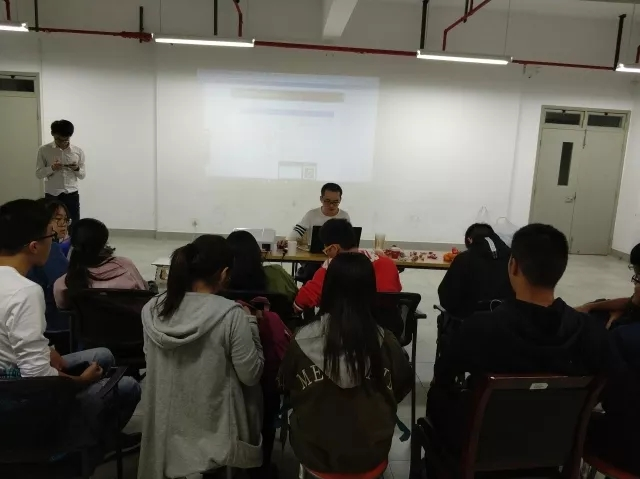
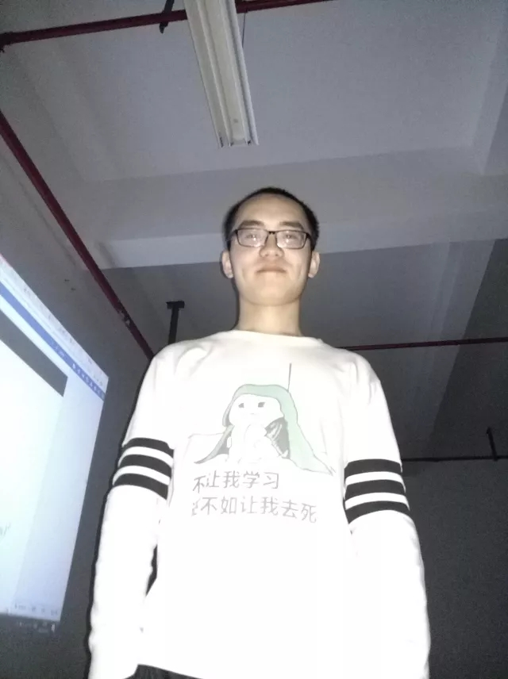
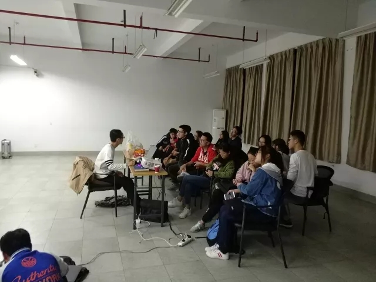
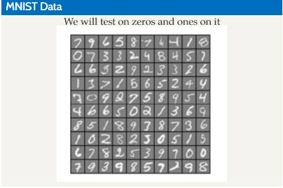
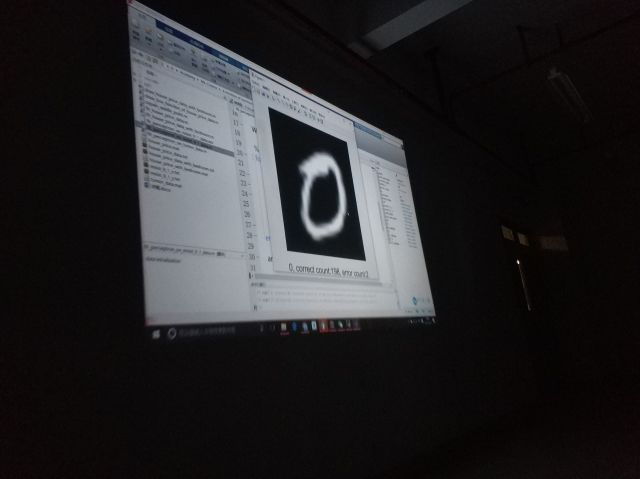
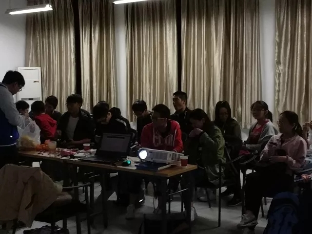

过完国庆的第一周，天气渐渐变寒，夏天最后还是过去了。

2017年10月13日下午六点，上海大学开源社区在东区计算机楼504举行了本学期的第四次活动。

依旧是约共二十多人参与了本次活动。感谢大家的参与，第一周买的零食终于吃完了。

<!--more-->

比起以往的的分享，本次有较多的数学知识。

首先简单的介绍了机器学习的种类及其应用。

随后npa老师以预测房产价格数据为例，讲述了几个机器学习中的优化算法。

在最后，npa老师使用matlab演示了识别MNIST数据集（手写数字数据）中的数字0和1。

| 附录 |
| :------- |
| [本次活动的PPT、matlab程序](https://github.com/shuopensourcecommunity/meta-OSC/raw/master/activities/2017/autumn/week5-A%20intuition%20of%20machine%20learning/extra.zip)|

