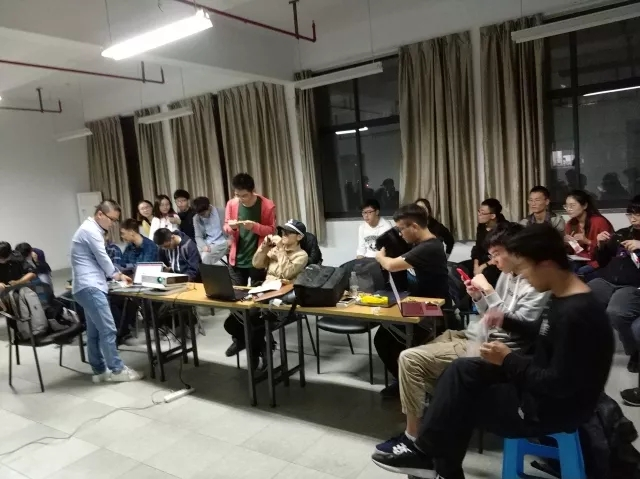
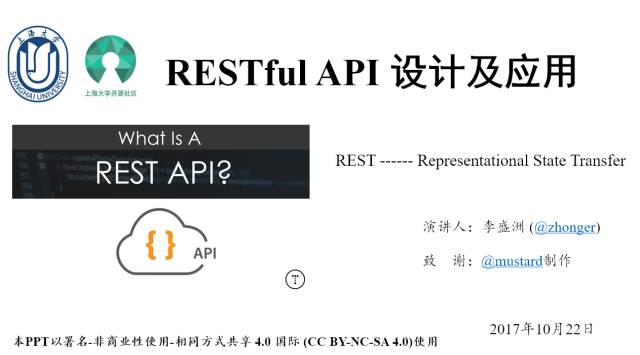
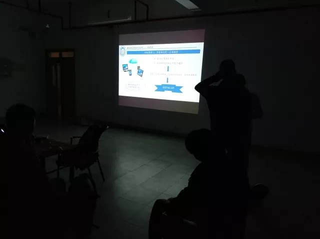

转眼间已经是第六周，俗话说得好，过完一半另一半也快过完了。

2017年10月20日下午六点，上海大学开源社区在东区计算机楼504举行了本学期的第五次活动。

依旧是约共二十多人参与了本次活动。感谢大家的参与，今天补充了零食，希望大家吃得开心。

本次分享主讲人是  @李盛洲  学长，李盛洲学长制作并维护了很棒的开源社区镜像站。

<!--more-->

在web开发的新时代到来之后，REST迅速成为主流的前后端通信的机制。

学长从http/https讲起，阐述了RESTful API兴起i的历史以及几种前后端通讯方式的比较，还补充了时下流行的对象存储/云服务等知识。

随后，详细地介绍了RESTful API的设计准则，注意事项，并以github和豆瓣的真实API为范例进行了讲解，并简单介绍了浏览器开发者工具的使用。

| 附录                                       |
| :--------------------------------------- |
| [本次活动的PPT](https://github.com/shuopensourcecommunity/meta-OSC/raw/master/activities/2017/autumn/week6/RESTful%20API.pptx) |
| [开源的SSL证书](https://letsencrypt.org)      |
| [开源的对象存储服务](https://minio.io)            |
| [豆瓣应用API](https://developers.douban.com/wiki/?title=guide) |
| [Github API](https://developer.github.com/v3) |