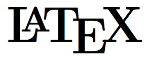

> 模板作者：zeakey
>
> Github：https://github.com/zeakey/master-thesis

<!-- more -->

##  Latex的优点

1. 最大的优点是免费；
2. 优美的数学公式渲染，而且熟悉之后打公式打得非常快，特别是非常复杂的积分运算，这一点 office 系列软件我还没发现有超过 LaTex 的地方；
3. 方便的图表、公式和参考文献的交叉引用，这是我用 LaTex 的主要原因。当你有很多图表，公式和参考文献，并且要在正文中反复引用的时候，这些图表、公式和文献的标号将会让你头疼，特别是当你写好之后想在中间插入新的图表或者公式，修改后面图表的标号以及正文中引用的标号将非常麻烦 (Word 中有没有方便的做法我不确定)；
4. 支持矢量图插入；如果论文中需要插入 Matlab 或者 R 等生成的曲线图，转换成 png/jpg 之后插到论文中放大会不清晰，你可以另存为 esp 矢量图，这样不论你放大多少倍图表依然清晰如故，参考我论文中图 3.3 和图 3.5;
5. 更加专业的排版，比如英语单词的换行，Latex 会根据音节的完整性对单词进行换行；
6. 很多学术出版物只接受 Latex 的投稿。

## Latex 的缺点

1. 不能马上预览排版的结果，需要编译过程；
2. 对中文支持还不太友好；
3. 中文的资料比较少，可能编译报错之后有可能搜不到中文的资料，这时候你就懵了。

## 使用说明

> ​    在 Win7&Win10 的 Texlive2016 环境下能够编译通过。这里我推荐大家使用 TexLive 这个发行版。TexLive 跨平台，有 Windows，Ubuntu 和 Mac 版本，而且它的包管理器也很方便。
>
> Tex 编辑器推荐 TexMaker，推荐的原因也是:
>
> ​        1)  跨平台
>
> ​        2)  可以分栏预览，不像 Texlive 自带的编辑器，需要新开一个窗口预览 PDF。

### 编译的时候需要注意的

当前版本并没有写封面、中英文摘要这些部分，只用 Latex 写了正文。所以你需要用 Word 写目录之前的所有内容，然后导出 PDF，最后在源代码中使用 


```latex
       \includepdf[pages={1-8}]{cover.pdf}
```

导入它们。关于这部分，请参考源代码中我的注释。

关于不同学科领域的搜索功能，可以在官网 http://www.wolframalpha.com/ 下面找到示例和介绍。

### 关于参考文献是 [?] 的问题

很多同学们第一次编译，或者是更新了 .bib 文件之后发现正文中的参考文献标号全是 '[?]'。如果你向 .bib 文件中更新了新的参考文献或者是第一次编译，你需要:

至于为什么要这么做，我也不知道。如果你是 TexMaker 用户，你可以在 ` 选项-> 配置 TexMaker-> 快速构建 ` 中将 ` 快速构建命令` 设置为 `pdflatex+bib(la)tex+` 两次 `pdflatex+` 查看 pdf，这样每次点击快速构建将自动完成以上 3 步。

相比只用 pdflatex 编译 .tex 文件，完成以上三步比较耗时。因此在没有更新 .bib 文件的时候只需要用 pdflatex 编译 .tex 源文件即可。建议只在更改了 .bib 参考文献的情况下使用 ' 三步编译 '。这并不意味着你需要反复配置 Texmaker，你只需要在点击编译按钮的时候选择不同的编译模式即可 (其它 LaTex 环境也应该有类似功能)。

### 关于字体问题

如果你在 Linux 或者是 Mac 上使用 LaTex，特别如果你的系统是英文的，很可能会没有相关的字体造成编译报错。我提供了一个脚本 download-fonts.sh, 使用这个脚本即可下载所需字体。既然你在 Linux 上使用 LaTex，我相信怎么使用这个脚本不需要我详细说明。

###  关于英文换行的问题

很多时候你会发现当某一行既有汉字又有英文的时候，换行的时候英文的排版不太对。这是因为英文天然用空白分隔单词，而汉语没有这个特性。当汉字和字母混合的时候，LaTex 就无法正确的分隔单词了。我建议所有的汉字和单词都用空白符分隔开，这样就不会出现排版问题。

###  无法下载/下载速度慢

由于众所周知的原因，在国内可能你从 Github 上下载的速度比较慢，我提供了另外一个链接，你可以直接下载整个代码包： http://zhaok-data.oss-cn-shanghai.aliyuncs.com/doc/master-thesis.zip

### 上海大学CTAN 镜像

上海大学镜像站现提供官方认证的 CTAN 镜像，供同学们使用。

镜像地址：http://mirrors.shu.edu.cn/CTAN

帮助文档：http://mirrors.shu.edu.cn/help/ctan.html

