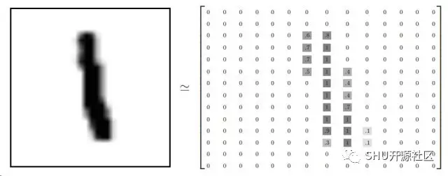
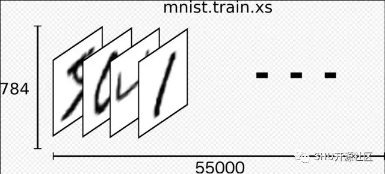
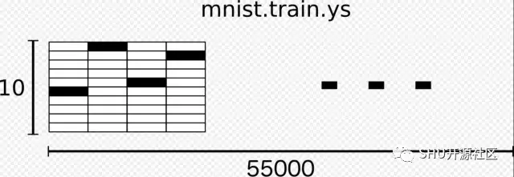
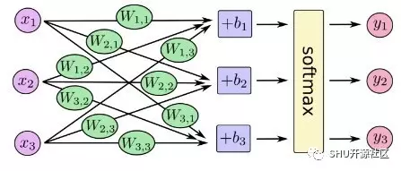
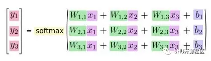
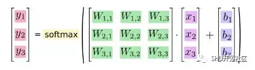

学编程的时候，传统上第一件事就是 print 一个 “Hello World”，在机器学习领域，这件事情就是 MNIST。

MNIST 是一个简单的计算机视觉数据集，它包含了一些手写数字图像其中也包含了每个图像的 label，指示了每个图像是什么数字。

本教程中，我们将会训练一个通过图片来预测数字的模型。我们的目的不是用复杂的方法构建一个学术上表现最优的模型，而只是初尝一下 TensorFlow——以后的章节里我们会给出效果非常好的代码的。这样来讲的话，我们先来用一个很简单的模型，Softmax 回归。

这份教程的实际代码是非常短的，有意思的事情三行就写完了。不过，理解其后的原理是很重要的：TensorFlow 的工作方式和机器学习的核心原理。因此，我们将会步步为营地来解析这些代码。

> 原作者：npa(开源社区)
>
> 作者博客：http://science.npa.farbox.com/
>
> *转载已获作者授权

<!-- more -->

## Before Starting

本教程是 `mnist_softmax.py` 的代码解释，一行一行地说明了发生了什么事情。

你可以用不同的方法来使用本教程，包括：

边看代码解释，边一行一行地把代码片段粘贴到 Python 环境里面去

读整个解释之前先运行整个 `mnist_softmax.py`，然后通过读教程来理解你不太明白的部分代码

在本教程中我们将会：


1. 学习 MNIST 数据和 softmax 回归

2. 写一个通过一张图片的每一个像素点来识别它是哪个数字的函数

3. 用 TensorFlow 来通过让这个模型 “看” 数以千计的样本来训练它，以教会它识别数字（通过跑我们的第一个 TensorFlow session 来做这件事）

4. 用测试数据集来检查模型的准确度

## MNIST数据集

复制以下两行代码并运行，它将会在当前目录下新建一个 `MNIST_data` 目录，下载数据，并自动读入。

```python
from tensorflow.examples.tutorials.mnist import input_data
mnist = input_data.read_data_sets("MNIST_data/", one_hot=True)
```

MNIST 数据分为三部分：55000 份训练数据 (`mnist.train`), 10000 份测试数据 (`mnist.test`), 5000 份验证数据 (`mnist.validation`)。这个分割是很重要的：在机器学习中我们需要一些没有用来学习的数据，来验证是不是真的学到了一些结果。

上文提到，每一个 MNIST 数据都有部分：一张手写的数字图片，和一个标签数字 (0-9)。我们把图片叫做 "x"，把标签叫做 "y"。训练集和测试集都包含了图片和标签，比方说训练集的图片是 `mnist.train.images`，标签是 `mnist.train.labels`.

每一张图片都宽高 28 像素，可以看作一个大数组：



我们可以把这个二维数组变成一个 28 x 28 = 784 维度的向量。怎么展开它无关紧要，只要保持每个图片都是用一致的方法展开的就行。这样来看，MNIST 图片就是一堆 784 维的向量，而且结构丰富 (注意，这篇文章里面的结果是通过计算加强可视性了的)。

把图片扁平化成一维向量抛弃了图片的二维结构，这可能不是个好主意。最佳的计算机视觉模型是会利用这种结构的，我们在后面的教程中会提到。不过这里我们只用了简单的 softmax 回归，没有利用这种结构。

上面的结果就是 `mnist.train.images` 是一个 shape 为 [55000, 784] 的 tensor。第一个维度就是一系列图片的下标，第二个维度就是这张图片的每一个像素点。这个 tensor 最里面的成员就是特定图片的特定像素点的灰度值，在 0-1 之间。



每个 MNIST 图片都有一个对应的标签， 是一个 0-9 的数字，代表了手写图片写的是什么。

本教程中，标签应该是 "one-hot" 向量。one-hot 向量是一个大部分都是 0，但是有一个 1 的向量。这个例子中，1 在第 n 个位置的话就代表这是数字几。比方说，3 的 one-hot 向量形式就是 [0, 0, 0, 1, 0, 0, 0, 0, 0, 0]。结果 `mnist.train.labels` 就是一个 [55000, 10] 的向量。



### softmax 回归

我们知道 MNIST 里面每一个图像都是手写的 0~9，所以所有的结果也就是 10 种可能。我们想要这个模型可以看一眼这个图像，然后对每一个可能结果给出一个可能性。比如说，我们的模型看一下这张图片然后说它 80% 是 9，5% 它可能是 8（因为 8 和 9 两个数字上部都有个圈），然后因为不完全确定，给其它的数字一个很低很低的可能性。

这就是一个经典而又简单自然的 softmax 回归场景。如果你要给一个东西属于不同的几个类别的可能性打个分，那就应该用 softmax。因为 softmax 给出的就是一系列加和为 1，自身值在 0-1 的” 可能性 “。以后就算我们训练了更复杂的模型，最后一层网络也还就是 softmax。

softmax 回归有两步：一是搜集输入的数据是某种类的” 证据 “，二是把这些” 证据 “转换成一个可能性。

怎么来收集这些证据呢？对每一个类，我们可以对每一个点的灰度计算一个带权求和，把这些权加起来当作搜集到的证据。正的权也就是说这个图像可能是本类，负权就是说它不是本类。

下面的图标展示了一个训练好的模型里面这些权矩阵的样子，红色代表负权，蓝色代表正权。

（译注：我认为这里有必要详细说一下这个方法。

首先可以这样想象，建立十个二维矩阵，分别代表 0-9。它的大小和图片的大小是一样的，它的子元素下标 (x, y) 对应的就是图片在 (x, y) 位置的那个点，这个子元素的值就是说，“现在我只考虑这个点，它使得这张图更像本类呢还是更不像本类呢？”，更像为正，不像为负。把训练好了的这十个矩阵画出来，就是下面这张图。

可是我们的图片是扁平化的，成了一个 784 维向量，对应的，这些权值矩阵也要同理压缩，所以我们得到 10 个 784 维的权重向量。所以就得到一个 shape 是 [784, 10] 的 tensor。接下来一张图进来，shape 是 [1, 784]，一共有 784 个点，它的每个点先依次和第 1 行指示这张图是不是 0 的 784 个权相乘，求和，得到一个值，然后依次和第 2 行指示这张图是不是 1 的 784 个权相乘，求和……以此类推。最后得到十个值，也就是这张图分属十个类的 “证据” 值。熟悉线性代数的同学可能发现这就是一个典型的矩阵相乘，这就是为什么后面用矩阵乘法代替了看上去很可怕的求和写法。）


我们还可以加上一些叫做偏置（bias）的附加证据，这是为了体现跟输入本身关系不大的一些事实。总的来说，一个类 i，给定一个输入 x，证据 evidence 就是：

>  evidencei=∑jWi, jxj+bi

其中 `WiWi` 是第 i 类的权， `bibi` 是第 i 类的偏置，j 的作用是遍历用的下标，用这个来遍历输入图片 x 的每一个像素。接下来我们用 softmax 方程，把得到的这些证据的总和变成我们的预测可能性 y。

> y=softmax(evidence)

这里 softmax 的作用是我们叫做 “激活函数” 或者” 连接函数 “的一种东西，为的是把上面那个线性方程的输出调整成我们想要的样子——在这个例子的语境下面就是十个类的可能性分布。形象来说就是把我们收集到的” 证据 “变成我们的输入图片是某个类的” 可能 “。softmax 函数定义如下：

>  **softmax(x)=normalize(exp(x))**

如果展开的话是这个样子：

> **softmax(x)i=exp(xi)/∑jexp(xj)**

第一种写法好理解一点：就是先对输入 x 求一下 exex 然后归一化。第二种写法展示了具体怎么归一化：就看这个类 i 的证据 x 求 exex 之后占所有类的 exex 之和的多少。

这里用了求幂也就意味着多一个单位 “证据” 会表现为乘一个 e，反之除上一个 e。没有任何一个类的可能性会是 0 或者负数。然后再用 softmax 把他们归一化得到一个最后的可能性分布。（ Michael Nielsen 的这本书有一个带可交互还可视化的例子，可以帮助更直观的理解 softmax。）

你可以把 softmax 回归理解成下面这张图的样子，不过真实情况下还有很多很多的 x 输入罢了。（而且 Wi, jWi, j 因为有 10 个类，所以 i 要到 10）。对于每个输出我们都是用对应类的权矩阵和输入 x 乘起来，加上偏置，然后 softmax 归一化。



如果我们写成方程的样子的话：



我们也可以所谓”向量化“这个过程，把它变成一个矩阵和输入向量做乘法。这对计算和理解都有好处。



要写得更加紧凑的话：

> **y=softmax(Wx+b)**


### 实现回归

用 Python 的时候，为了实现高效数字计算，我们经常 Numpy 一类的库，把一些很复杂的计算，比如矩阵乘法之类的放到 Python 外面去运行，使用用其他语言实现的高效代码。不幸的是，这样每个操作都从 Python 切换出去 / 回来也还是有很多损失，如果你想要在 GPU 上面或者分布式构架上面跑运算的话这个损失更是巨大，因为传送数据有很高的代价。

TensorFlow 也把困难的计算放在 Python 之外，不过为了避免传送数据的损失 TensorFlow 做得更进一步。它不把单个的计算运算在 Python 之外，而是让我们定义一个由可操作的运算符组成的运算图，然后这个运算图的运算完全跑在 Python 之外。（好几个机器学习库里面也有这种实现方法）

要使用 TensorFlow，我们先要 import。

```python
import tensorflow as tf
```

我们用一些变量符号来描述这些数学上的互相操作，先来造一个变量：

```python
x = tf.placeholder(tf.float32, [None, 784])
```

x 不是一个确定的值，而是个占位符 placeholder，一个跑计算的时候我们会传给 TensorFlow 的参数。我们想要可以传入任意张的 MNIST 图片，每一张都是一个压缩成 784 维向量的图。我们将其表达为一个 `[None, 784]` 的浮点数 2D tensor，这里 `None` 的意思是维度任意（对应了我们可以一次输入任意张图片）。

我们还需要提供模型的 weights 和 biases。我们可以把他们也想象成输入参数，不过 TensorFlow 中有一种更好的方法来处理他们：变量 Variables。 变量是在 TensorFlow 的运算图中可以变动的一些值，它可以被运算使用，甚至可以被运算修改。对于机器学习应用场景，变量基本上就当模型参数用。

```python
W = tf.Variable(tf.zeros([784, 10]))
b = tf.Variable(tf.zeros([10]))
```

我们通过给 tf.Variable 一个初始值来初始化 Variable 的值：本例中 W 和 b 都被初始化为 0。既然我们是要去学习 W 和 b 的，初始值也就没什么所谓了。

注意到 W 的 shape 是 [784, 10]，这是因为我们希望 W 乘上一个 784 维的向量得到这个图像分属十个类的可能性（这里的具体说明见上面的译注）。b 的 shape 是 10，这样我们就可以直接把它加到各个可能性上。

现在可以来定义我们的模型。一行就够了。

```python
y = tf.nn.softmax(tf.matmul(x, W) + b)
```

首先我们把 x 和 W 相乘，也就是 `tf.matmul(x, W)` 这一句。这和我们方程里头写的 Wx 不太一样，就像上面括号里说的，这是为了处理 x 这个二维输入的小技巧，因为一个 [784, 10] 和一个 [不确定数字 , 10] 的矩阵怎么相乘呢？毕竟矩阵相乘没有交换律：)。然后我们加上 b，最后施加 `tf.nn.softmax`。

（译注：`matmul` 是矩阵相乘，这和 TensorFlow 中 multiply 的概念是不一样的，下面将有独段解释。）

好了。一行就定了模型，再加上几行的准备工作，这就完事了。这可不是说 TensorFlow 造来就是为了让 softmax 变得简单的：TensorFlow 是设计来方便构造各种各样数字模型的，从机器学习模型到物理模拟都是这样。另外，一次定义，到处能跑：不管是 CPU，GPU，还是你的智能手机。

### 训练

为了训练模型，我们需要告诉这个模型什么叫 “好”。嘛，实际上，在机器学习里面我们一般教这个模型什么叫 “坏”。这个度量我们叫做 cost 或者 loss（或者 error），代表了模型的输出和真正的答案之间的差距。我们把这个 error 尽可能缩小，它越小模型就越好。

一个很常用也很好用的 loss 函数就是 “交叉熵”（cross-entropy）。交叉熵这个主意一开始是信息论领域里面的一帮天才想信息压缩编码的时候想出来的，不过结果它成了从赌博到机器学习内的很多领域的重要概念。交叉熵定义如下：

> Hy′(y)=−∑iy′ilog(yi)

这里 yy 是我们预测的分布，y′y′是真正的分布（也就是数据介绍那一部分说的 one-hot 向量）。粗略来看，交叉熵是在度量我们的预测度量现实的时候到底有多差。更详细的交叉熵介绍超出了本文范围，但是还是很值得学一下。

为了实现交叉熵首先我们需要一个 placeholder 来输入正确答案：

```python
y_ = tf.placeholder(tf.float32, [None, 10])
```

然后实现交叉熵函数

```python
cross_entropy = tf.reduce_mean(-tf.reduce_sum(y_ * tf.log(y), reduction_indices=[1]))
```

首先，tf.log 当然就是运算每个 y 的对数。然后我们把 y_ 和 tf.log(y) 的结果乘起来。接下来，由于 reduction_indices=[1] 这个参数的指示，tf.reduce_mean 会把这个结果的第二个维度加和。最后，tf.reduce_mean 会计算一个 batch 里面所有加和的平均。

（译注：说明一下 batch 这个概念，就是说一小批量的数据，因为有的时候数据量太大你想一次喂小批量的数据训练，或者你想先喂 100 个做下预测看看现在训练的效果如何，这时候一个 batch=100 的设计就会比较舒服。上面的例子里当写下输入维度为 None 的时候就相当于平常写函数留了个参量 batch 等待传入，不过要注意在后面设计模型的时候做矩阵乘法数目的对应。

说到这个问题有同学可能就会觉得 `y_ * tf.log(y)` 这一句是一个 `[None, 10]` 的矩阵和一个 `[None, 10]` 的矩阵相乘，根本乘不了。这里要说明一下，官方 api 解释了，tf 中乘号是 `tf.multiply` 的一个 shortcut，multiply 是所谓的 element-wise 的，或者了解的同学会知道这个就是 Hadamard 乘积，这里借用 Nielsen 书中的一张图：


因为是元素互乘，最后还是得到一个 `[None, 10]`，正好实现了交叉熵。

好了，我们继续。）

注意，在总的文首给出的源代码里我们没有用这个写法， 因为这个写法数值上不太稳定。为了取代它，我们用了 `tf.nn.softmax_cross_entropy_with_logits` 这个函数，传给它没有归一化的可能性输出。（本例是 `softmax_cross_entropy_with_logits on tf.matmul(x, W) + b)`）。这是因为直接用内部的 `softmax_cross_entropy` 数值运算上稳定些。在你自己的代码里也可以考虑用 `tf.nn.softmax_cross_entropy_with_logits` 来代替外部写法。

现在已经定义好了我们想让模型做什么，很容易就可以用 TensorFlow 来训练它做这个事儿。因为 TensorFlow 知道你的整个运算图是什么是样子的，它可以自动用后向传播算法来高效地算出你的变量会如何影响你要求最小化的那个 loss 变量。然后它就会运用你选择的优化算法来改变对应的变量以减少 loss。

```python
train_step = tf.train.GradientDescentOptimizer(0.05).minimize(cross_entropy)
```

这里，我们要求 TensorFlow 用梯度下降法来最小化 cross_entropy 这个值，学习率 Leaning Rate 定为 0.05。梯度下降是一个很简单的过程，TensorFlow 就是先对每个变量求一下其对于 cost 的导数，然后把它往导致 cost 下降的方向（负导数方向）降一点点（大小和学习率有关）。TensorFlow 还提供了很多其他的优化器：要换优化器也就是改一行代码的事情。

TensorFlow 在幕后做的工作其实就是，在计算图里面添加一些额外的运算来实现后向传播和梯度下降，然后 return 给你一个能够按减少 cost 方向改动各变量一点点的操作。

现在，我们建立一个 InteractiveSession，启动我们的模型了。

```python
sess = tf.InteractiveSession()
```

首先，别忘了初始化变量。

```python
tf.global_variables_initializer().run()
```

然后来训练——这里我们训练1000次。

```python
for _ in range(1000):
  batch_xs, batch_ys = mnist.train.next_batch(100)
  sess.run(train_step, feed_dict={x: batch_xs, y_: batch_ys})
```

每个循环中我们从训练集中随机获得 100 个数据，作为一个 batch，提供 batch 数据给 placeholder，让 Session 来跑 train_step。

用小批量的随机数据来训练叫做随机训练——在这个场景下我们叫它随机梯度下降。理想来说我们会想要一次喂进所有的数据，因为这样明显更合逻辑，不过这样做需求是很高的。所以我们取而代之使用每次使用一个不同的子集来训练，这样实现起来简单一点儿，而且基本能达到要求。

### 评估模型

我们的模型效果如何？

嗯，我们先来看看预测得怎么样。`tf.argmax` 是一个很有用的函数，它找到一个 tensor 中某一个维度上最大的值，返回这个值的下标。比如说 `tf.argmax(y, 1)` 是我们的模型认为的，每个输入所属的类，而 `tf.argmax(y_, 1)` 就代表了正确的数字。我们可以用 `tf.equal` 来检查我们的预测是否和真实数据相对应。

```python
correct_prediction = tf.equal(tf.argmax(y,1), tf.argmax(y_,1))
```

这会得到很多布尔值，为了检查正确的部分有多少，我们把这些布尔值转换成浮点数然后求个平均。比如说 `[True, False, True, True]` 会变成 `[1,0,1,1]` 然后变成 0.75

```python
accuracy = tf.reduce_mean(tf.cast(correct_prediction, tf.float32))
```

最后我们让 sess 给出测试数据上的正确率：

```python
print(sess.run(accuracy, feed_dict={x: mnist.test.images, y_: mnist.test.labels}))
```

这个数字大略在 92%。

结果如何呢？不怎么样。实际上，还挺差的。这是因为我们的模型很简单。做些小改动就能让这个结果变成 97%，最好的模型可以做到 99.7% 的准确率！（这里是一系列模型的结果）

重要的是我们从这个模型中学到的概念。不过，如果你对这个结果还是不太满意，可以看看下一个章节的内容，我们可以做得比这节好得多，并且学会如何使用 TensorFlow 来构建更加精巧的模型。

